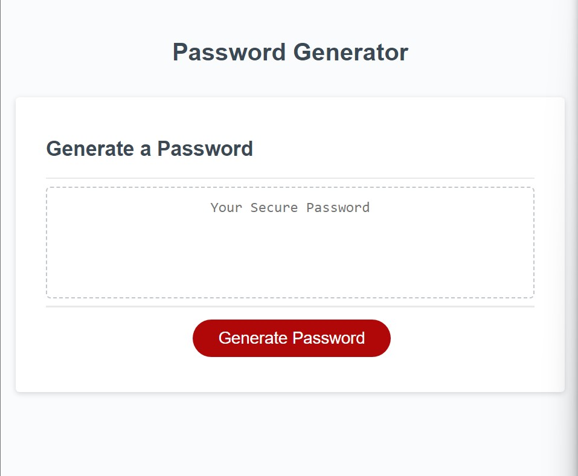

# Password Generator

## Description
Password Generator is a browser application that the user can use to generate a random password based on criteria that the user selects.
## Installation
You can clone this repository on GitHub at https://github.com/averyjmiller/password-generator
## Usage
Users may use this browser application to randomly generate a password based off of the user's criteria. Users may visit this browser application at https://averyjmiller.github.io/password-generator/. Here is a screenshot of the deployed webpage:

## Credits
* Starter code was provided by the TA's
* 'indexOf' and 'splice' methods were provided by https://sentry.io/answers/remove-specific-item-from-array/
## License
Please refer to the LICENSE in the repo.